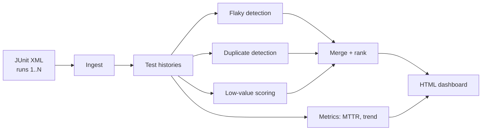

# pulse

[](https://github.com/kallurayaankit/pulse/actions/workflows/test.yml)
[](https://opensource.org/licenses/MIT)
[](https://www.python.org/downloads/)

**Continuous test-suite health monitor.** Finds flaky tests, duplicate coverage, and low-value tests. Tracks flakiness trend and mean time to repair.

```bash
pip install -e .
pulse analyze examples/reports --open
```

## The problem

Your test suite has three invisible problems:

**1. Flaky tests.** They pass on Tuesday, fail on Wednesday, pass again on Thursday. Nobody knows which ones, because the CI retries them and moves on.

**2. Duplicate coverage.** Two tests in the same file, testing the same code path, with slightly different names. Both run every PR. Only one adds value.

**3. Low-value tests.** Tests that have never failed. Not because the code is perfect — because the test doesn't actually assert anything meaningful.

Existing tooling handles these one at a time. You need five tools to see your whole suite. `pulse` does all four (flaky, duplicate, low-value, health metrics) in one pass.

## What it finds

| Signal | How it's detected |
|---|---|
| **Flaky** | Pass↔fail transitions across consecutive runs, normalized by run count |
| **Duplicate** | Name similarity + behavioral correlation (weighted 30/70) |
| **Low value** | Never failed + high name overlap with other tests |
| **MTTR** | Mean length of consecutive failure streaks before recovery |
| **Suite flakiness** | Mean flakiness across all tests |
| **Runtime trend** | First-half vs second-half suite duration comparison |

## Architecture



## Quickstart

Point it at a directory of JUnit XML files. Each file is one CI run. Filenames become run IDs, sorted lexicographically.

```
examples/reports/
├── run-000.xml
├── run-001.xml
├── run-002.xml
└── ...
```

```bash
pulse analyze examples/reports --open
```

Output:

```
Ingesting examples/reports
  120 test executions
  12 distinct tests

=== Health ===
  flaky:        3
  duplicates:   2
  low value:    1
  suite flakiness: 0.14
  MTTR:         1.8 runs
  runtime trend: stable

=== Recommendations ===
  [quarantine  ] test_session_expiry
      flakiness score 0.55 - flips on 5 of 9 consecutive runs.

  [investigate ] test_signup_weak_password
      flakiness score 0.33 - investigate for race conditions.

HTML: reports/pulse.html
```

## Recommendations

Every test gets one of five recommendations:

| Recommendation | When |
|---|---|
| `quarantine` | Flakiness ≥ 0.5. Remove from CI, investigate separately. |
| `investigate` | Flakiness between threshold and 0.5. Might have a real race condition. |
| `prune` | Duplicate of another test in the same file. |
| `rewrite` | Low value score. Never failed, high name overlap. |
| `keep` | No signals. Leave it alone. |

## Flakiness scoring

A test's flakiness score is **transitions divided by run count minus one**.

The critical detail: **a test that fails 100% of the time has a flakiness score of 0.0.** It's a regression, not a flake. A stable failure is *information*. A flaky failure is *noise*.

```
passed, passed, passed, passed, passed   -> 0.00  (stable pass)
failed, failed, failed, failed, failed   -> 0.00  (regression, not flaky)
passed, passed, failed, passed, passed   -> 0.50  (two transitions / four gaps)
passed, failed, passed, failed, passed   -> 1.00  (maximally flaky)
```

## Duplicate detection

Two signals, weighted:

- **Name similarity** (weight 0.3): SequenceMatcher ratio on test names.
- **Behavioral similarity** (weight 0.7): fraction of runs where both tests had the same status.

The behavioral weight is higher because it's a stronger signal. But behavioral alone is unreliable — two tests that always pass will look perfectly correlated. That's why we require name similarity ≥ 0.5 as a gate before scoring.

## Health metrics

**MTTR (mean time to repair):** for every failure streak, count how many runs it persisted. Average across all streaks. An MTTR of 1.8 means a test typically takes about 2 runs to be fixed. An MTTR of 8.0 means failures linger — that's a signal about process, not code.

**Suite flakiness:** mean flakiness across all tests. Under 0.05 is healthy. Over 0.20 means the suite is not trustworthy.

**Runtime trend:** compares first-half vs second-half suite durations. `improving` if the second half is 10% faster, `worsening` if 10% slower.

## CLI

```bash
pulse analyze <reports-dir>             # generate HTML report
pulse analyze <reports-dir> --open      # open in browser
pulse analyze <reports-dir> --json out.json  # also write raw data
pulse analyze <reports-dir> --fail-on-findings  # exit 1 if actionable
pulse version
```

## Configuration

`.env`:

```
PULSE_FLAKY_THRESHOLD=0.2
PULSE_DUPLICATE_THRESHOLD=0.85
PULSE_LOW_VALUE_THRESHOLD=0.3
PULSE_MIN_RUNS=3
```

The minimum-runs threshold prevents false positives on short histories. A test that appears in only 2 runs can't be reliably classified.

## What this is not

- Not a test selector. It doesn't decide which tests to run on a given commit. It decides which tests to keep, fix, or delete.
- Not a CI integration. It reads JUnit XML from disk. Wire it into CI yourself with `--fail-on-findings`.
- Not a dashboard service. The output is a self-contained HTML file. Open it, share it, email it. No backend.

## Status

Early. Full pipeline works end-to-end. 30+ unit tests passing. No LLM calls — everything is deterministic and instant.

Roadmap: git history integration (was the failure actually fixed?), commit correlation (which commits introduced the flake?), trend visualization over time.

## License

MIT
